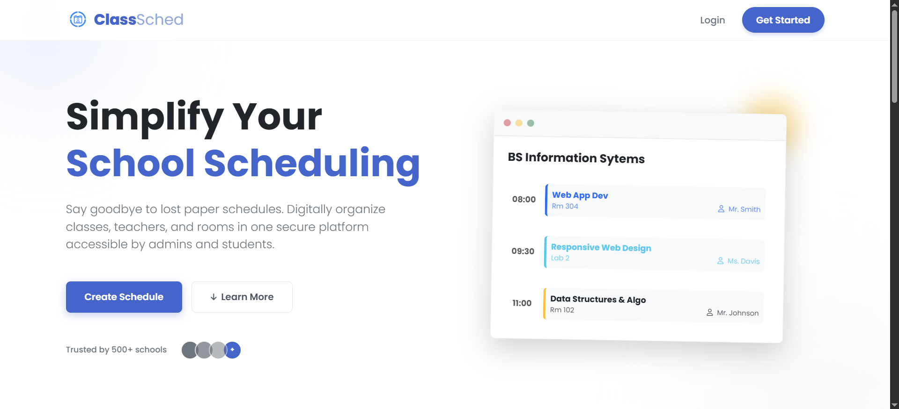

  

## About Me

Passionate Information Systems student with a strong interest in UI/UX design, front-end development, and project management. I enjoy creating user-friendly digital solutions and continuously improving my technical and design skills through academic and personal projects.

## Featured Projects

<table>
<tr>
<td width="45%">

</td>

<td width="55%">

### 📅 Class Scheduling System
**Project Lead | WAD & RWD Final Project**

Designed and developed a user-friendly class scheduling application that streamlines the management of classes, teachers, and room assignments for schools.

**Tech Stack:** HTML, CSS, PHP, MySQL

🔗 **Repository:**  
https://github.com/itsmeydrey/wad-rwd-final-project

</td>
</tr>
</table>

## Details
- 🌱 Currently learning:
  - Applications Development and Emerging Technologies 1
  - Business Process Management
  - IS Project Management 1
  - Financial Management

- 🎯 Interested in:
  - UI/UX Design
  - Web Development
  - Front-End Development
  - User Research

- 📫 Reach me at: **ydreyannramirez035@gmail.com**

## Languages and Tools:

## GitHub Stats

  

## Connect with me:

I'm always open to learning opportunities, collaborations, and discussions about UI/UX, web development, and Information Systems.

